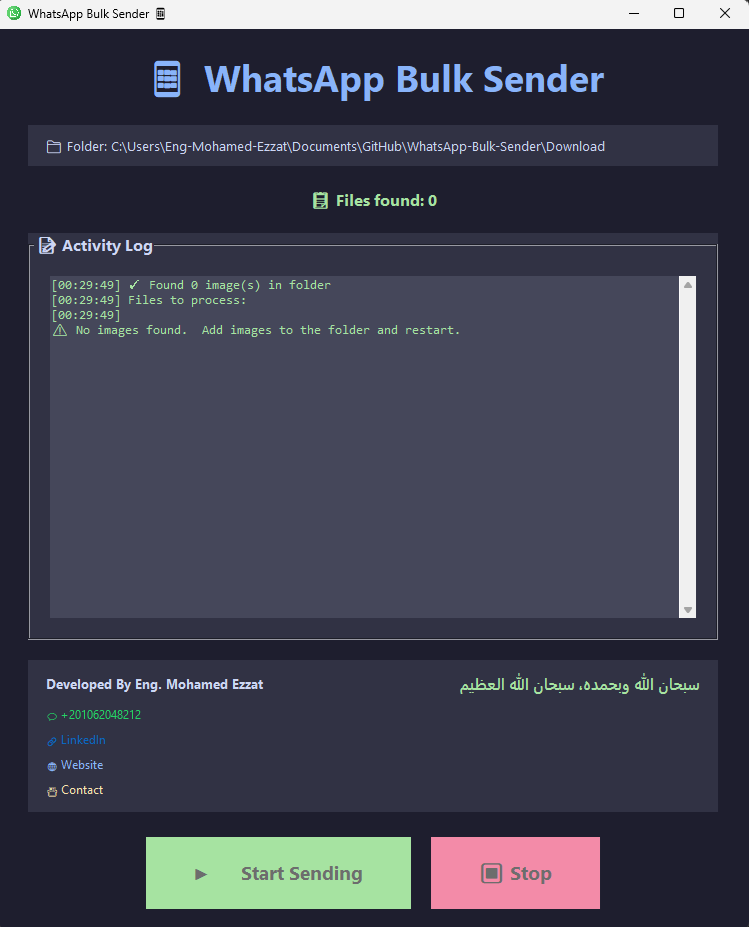

# 📱 WhatsApp Bulk Sender

A powerful and user-friendly Python GUI application for sending bulk WhatsApp messages with images. Built with Tkinter and PyWhatKit, this tool automates the process of sending personalized image messages to multiple contacts.


## 💾 Quick Download

### 🪟 Windows Users - Ready to Use!

**No Python installation required!** Download the standalone Windows executable: 

**[⬇️ Download WhatsAppBulkSender.exe](https://github.com/Eng-Mohamed-Ezzat/WhatsApp-Bulk-Sender/raw/main/Download/WhatsAppBulkSender.exe)**

Simply download and run - it's that easy!  🚀

---

## ✨ Features

- 🖼️ **Bulk Image Sending**: Send images to multiple WhatsApp contacts automatically
- 📝 **Custom Captions**:  Personalized captions for each recipient
- 🎨 **Modern GUI**: Beautiful dark-themed interface built with Tkinter
- ⏱️ **Smart Delays**: Random delays between messages to avoid blocking
- 📊 **Real-time Logging**: Activity log with timestamps
- ⏹️ **Stop/Resume**: Control over the sending process
- 🔄 **Auto-scan**:  Automatically detects images in the application folder
- 🌐 **Multi-format Support**: Supports JPG, JPEG, PNG, GIF, BMP

## 📸 Screenshots


*Main application interface*

## 🚀 Prerequisites

### For Windows Executable (. exe):
- ✅ Windows 7/8/10/11
- ✅ WhatsApp Web access
- ✅ Active internet connection
- ✅ Google Chrome browser

### For Python Script:
- Python 3.7 or higher
- WhatsApp Web access
- Active internet connection
- Google Chrome browser (required by PyWhatKit)

## 📦 Installation

### Option 1: Windows Executable (Recommended for Windows Users) 🪟

1. **Download the application:**
   - [⬇️ Download WhatsAppBulkSender.exe](https://github.com/Eng-Mohamed-Ezzat/WhatsApp-Bulk-Sender/raw/main/Download/WhatsAppBulkSender.exe)

2. **Run the application:**
   - Double-click `WhatsAppBulkSender.exe`
   - No installation needed! 

3. **Start sending:**
   - Place your images in the same folder as the . exe file
   - Follow the file naming format below

### Option 2: Run from Python Source Code 🐍

#### 1. Clone the Repository

```bash
git clone https://github.com/Eng-Mohamed-Ezzat/WhatsApp-Bulk-Sender. git
cd WhatsApp-Bulk-Sender
```

#### 2. Install Required Packages

```bash
pip install -r requirements.txt
```

*Note: Tkinter usually comes pre-installed with Python. If not:*

```bash
# For Ubuntu/Debian
sudo apt-get install python3-tk

# For Fedora
sudo dnf install python3-tkinter

# For macOS (using Homebrew)
brew install python-tk
```

#### 3. Run the Application

```bash
python whatsapp_sender_gui.py
```

## 📖 Usage Instructions

### Step 1: Prepare Your Images

Place your images in the **same folder** as the application (either .exe or . py file) with the following naming format:

```
<phone_number>_<caption>.<extension>
```

**Examples:**
```
+201234567890_Hello from Python! .jpg
+447700900123_Check out this amazing product.png
+919876543210_Happy Birthday!.jpeg
```

### Step 2: File Naming Rules

- ✅ **Phone Number**: Include country code (e. g., +20, +44, +91)
- ✅ **Underscore**: Separate phone number and caption with `_`
- ✅ **Caption**: Your message text
- ✅ **Extension**: .jpg, .jpeg, .png, .gif, or .bmp

**Valid Examples:**
- `+201062048212_Welcome to our service. jpg`
- `+447700900000_Special discount just for you.png`
- `+919876543210_Your order has been shipped.jpeg`

**Invalid Examples:**
- ❌ `201234567890.jpg` (missing caption)
- ❌ `phone_message.jpg` (no valid phone number)
- ❌ `+20123456789_message.txt` (wrong file format)

### Step 3: Launch and Send

1. Run the application (double-click . exe or run Python script)
2. The app will automatically scan for images
3. Review the file list in the activity log
4. Click **"▶️ Start Sending"** to begin
5. The first message will open WhatsApp Web (scan QR code if needed)
6. Messages will be sent automatically with delays
7. Click **"⏹️ Stop"** to halt the process anytime

## ⚙️ Configuration

You can modify these settings in the code (Python version only):

```python
self.wait_time = 15          # Seconds to wait before sending (for WhatsApp Web to load)
self.tab_close = True        # Close browser tab after sending
delay = rd.randint(5, 10)    # Random delay between messages (5-10 seconds)
```

## 🎯 How It Works

1. **Scan**: Application scans the folder for image files
2. **Parse**:  Extracts phone numbers and captions from filenames
3. **Queue**: Prepares the sending queue
4. **Send**: Uses PyWhatKit to open WhatsApp Web and send messages
5. **Delay**: Waits randomly between messages to avoid detection
6. **Log**: Records all activities in real-time

## 🛠️ Technologies Used

- **Python 3** - Core programming language
- **Tkinter** - GUI framework
- **PyWhatKit** - WhatsApp automation library
- **Threading** - Background task execution
- **Webbrowser** - Opening web links
- **PyInstaller** - For creating standalone Windows executable

## ⚠️ Important Notes

### First Run
- On first message, WhatsApp Web will open
- You need to scan the QR code with your phone
- Keep WhatsApp Web logged in for automatic sending

### Rate Limiting
- WhatsApp may block your number if you send too many messages
- The app includes random delays to minimize this risk
- Start with a small batch to test

### Best Practices
- ✅ Test with your own number first
- ✅ Use meaningful, non-spammy messages
- ✅ Don't send to people who didn't consent
- ✅ Keep delays between messages (5-10 seconds minimum)
- ✅ Send in small batches (10-20 messages at a time)

### Windows Defender Warning
- Windows may show a security warning when running the . exe file
- This is normal for unsigned applications
- Click "More info" → "Run anyway" to proceed
- The application is safe and open-source

## 🐛 Troubleshooting

### Issue: "No images found"
**Solution**: Make sure image files are in the same folder as the script/exe and follow the naming format

### Issue: WhatsApp Web doesn't open
**Solution**: Check your internet connection and ensure Chrome is installed

### Issue: Messages not sending
**Solution**: 
- Verify phone numbers include country codes
- Check if WhatsApp Web is logged in
- Increase `wait_time` value for slower connections

### Issue: Application freezes
**Solution**: The app uses threading, but if it freezes, restart and try with fewer images

### Issue: Windows Defender blocks the . exe
**Solution**: 
- Click "More info" then "Run anyway"
- Or add an exception in Windows Defender
- The app is safe and the source code is available for review

## 📞 Contact & Support

**Developer:** Eng.  Mohamed Ezzat

- 💬 WhatsApp: [+201062048212](https://wa.me/201062048212)
- 🔗 LinkedIn: [eng-mohamed-ezzat](https://www.linkedin.com/in/eng-mohamed-ezzat/)
- 🌐 Website: [eng-mohamed-ezzat.github.io](https://eng-mohamed-ezzat.github.io/)
- 📇 Contact Card: [View Card](https://eng-mohamed-ezzat. github.io/ContactCard/)

## 🤝 Contributing

Contributions, issues, and feature requests are welcome!

1. Fork the repository
2. Create your feature branch (`git checkout -b feature/AmazingFeature`)
3. Commit your changes (`git commit -m 'Add some AmazingFeature'`)
4. Push to the branch (`git push origin feature/AmazingFeature`)
5. Open a Pull Request

## 📜 License & Attribution

This project is licensed under the **MIT License with Attribution Requirement**.

### ✅ You are free to:
- ✔️ Use the software for personal or commercial purposes
- ✔️ Modify and adapt the code
- ✔️ Distribute the software
- ✔️ Use it privately

### ⚠️ Requirements when modifying: 
- 📌 You **MUST** give credit to the original author
- 📌 You **MUST** link back to the original repository
- 📌 You **MUST** indicate if changes were made
- 📌 You **MUST** include the original license

### 📝 How to give attribution:

When you modify this code, include something like this in your README:

```
Based on WhatsApp Bulk Sender (https://github.com/Eng-Mohamed-Ezzat/WhatsApp-Bulk-Sender)
by Eng. Mohamed Ezzat (https://github.com/Eng-Mohamed-Ezzat)
```

---

**Original Repository:** https://github.com/Eng-Mohamed-Ezzat/WhatsApp-Bulk-Sender  
**Author:** Eng. Mohamed Ezzat  
**Contact:** +201062048212

سبحان الله وبحمده، سبحان الله العظيم

## ⚖️ Disclaimer

This tool is for educational and legitimate business purposes only.

- ⚠️ **Use responsibly** and in compliance with WhatsApp's Terms of Service
- ⚠️ **Do not spam** or send unsolicited messages
- ⚠️ **Respect privacy** and only message people who have consented
- ⚠️ The developer is not responsible for misuse of this tool
- ⚠️ WhatsApp may ban accounts that violate their policies

## 🌟 Show Your Support

If you find this project helpful, please give it a ⭐️!

## 📊 Project Stats


---

<div align="center">
  
**Made with ❤️ by Eng. Mohamed Ezzat**

سبحان الله وبحمده، سبحان الله العظيم

</div>